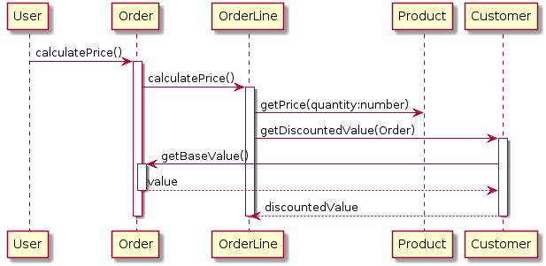

# Napkin 

Python as DSL for drawing sequence diagram.

## Motivation
The sequence diagrams are useful tool to capture the behavioural aspect of the
design. [PlantUML](http://plantuml.com) is a great tool to draw nice sequence
diagrams with simple human readable plain text.

However, the syntax of PlantUML is hard to use when there are nested calls,
where lifeline with multiple activation/deactivations are involved.
Unfortunately, this situation is quite common in sequence diagram for S/W.

For example, consider the following relative simple and common sequence
diagrams: 


PlainUML script for the diagram will be as follows:
```plantuml
@startuml
participant User
participant Order
participant OrderLine
participant Product
participant Customer

User -> Order : calculatePrice()
activate Order
Order -> OrderLine : calculatePrice()
activate OrderLine
OrderLine -> Product : getPrice(quantity:number)
OrderLine -> Customer : getDiscountedValue(Order)
activate Customer
Customer -> Order : GetBaseValue()
activate Order
Customer <-- Order: value
deactivate Order
OrderLine <-- Customer: discountedValue
deactivate Customer
deactivate OrderLine
deactivate Order
@enduml
```
It is quite hard to follow as there are multiple level of nested activation.

What if we express the same thing as following Python code ?

```python
@napkin.seq_diagram()
def distributed_control(c):
    user = c.object('User')
    order = c.object('Order')
    orderLine = c.object('OrderLine')
    product = c.object('Product')
    customer = c.object('Customer')

    with user:
        with order.calculatePrice():
            with orderLine.calculatePrice():
                product.getPrice(quantity='number')
                with customer.getDiscountedValue(order):
                    order.GetBaseValue().ret('value')
                    c.ret('discountedValue')
```
It defines objects and control starts with 'user' object, which calls orderLine.calculatePrice().
Basically, the sequence diagram is expressed as "almost" normal python code.


There are several advantages of using Python as DSL:
* Easy to write correct diagrams
* Many common mistakes are detected as normal Python error. For example, method
  call to an undefined object will be just normal Python error.
* Any Python editor can become sequence diagram editor


## Installation

Install and update using `pip`
```
pip install -U napkin
```

## Hello world

Write a simple script called hello.py as follows:

```python
import napkin

@napkin.seq_diagram()
def hello_world(c):
    user = c.object('user')
    world = c.object('world')
    with user:
        world.hello()
```
Then, the following command will generate hello_world.uml:
```
$ napkin hello.py
```

## More examples
[See example](./demo/readme_examples.py)
